# DSO202 Practical 01 — Kubernetes Cluster Fundamentals with Kind

**Course:** DSO202
**Practical:** 01 — Cluster Setup, Namespaces, Pods, Deployments, and Services
**Tool used:** [Kind](https://kind.sigs.k8s.io/) (Kubernetes IN Docker)

---

## Table of Contents

1. [Objective](#1-objective)
2. [Prerequisites and Verification](#2-prerequisites-and-verification)
3. [Cluster Architecture](#3-cluster-architecture)
4. [Stage 1 — Creating the Three-Node Cluster](#stage-1--creating-the-three-node-cluster)
5. [Stage 2 — Inspecting the Cluster and Its Components](#stage-2--inspecting-the-cluster-and-its-components)
6. [Stage 3 — Namespaces, Resource Quotas, and Limit Ranges](#stage-3--namespaces-resource-quotas-and-limit-ranges)
7. [Stage 4 — Pods](#stage-4--pods)
8. [Stage 5 — Deployments](#stage-5--deployments)
9. [Stage 6 — Scaling](#stage-6--scaling)
10. [Stage 7 — Rolling Updates and Rollbacks](#stage-7--rolling-updates-and-rollbacks)
11. [Stage 8 — Services](#stage-8--services)
12. [Stage 9 — Cleanup](#stage-9--cleanup)
13. [Key Learnings](#13-key-learnings)
14. [Conclusion](#14-conclusion)

---

## 1. Objective

The goal of this practical was to build a working understanding of core Kubernetes concepts — cluster architecture, namespaces, resource governance, Pods, Deployments, and Services — by provisioning a local multi-node cluster with **Kind** and driving it end-to-end using **kubectl**, in both imperative and declarative styles. Each stage below captures the commands executed, their purpose, and the corresponding evidence captured during the practical.

### Folder Structure

The practical was organized as follows:

```
dso202-practical-01/
├── README.md
├── cluster/
│   └── kind-cluster.yaml
├── evidence/
│   ├── 1.png ... 86.png
│   ├── final-state-all.txt
│   ├── final-state-events.txt
│   ├── final-state-nodes.txt
│   └── web-imperative-as-stored.yaml
├── manifests/
│   ├── 00-namespace.yaml
│   ├── 01-quota-and-limits.yaml
│   ├── 02-pod-web.yaml
│   ├── 03-deployment-web.yaml
│   ├── 04-service-clusterip.yaml
│   ├── 05-service-nodeport.yaml
│   └── 06-pod-client.yaml
└── report/
    └── practical-01-report.md
```

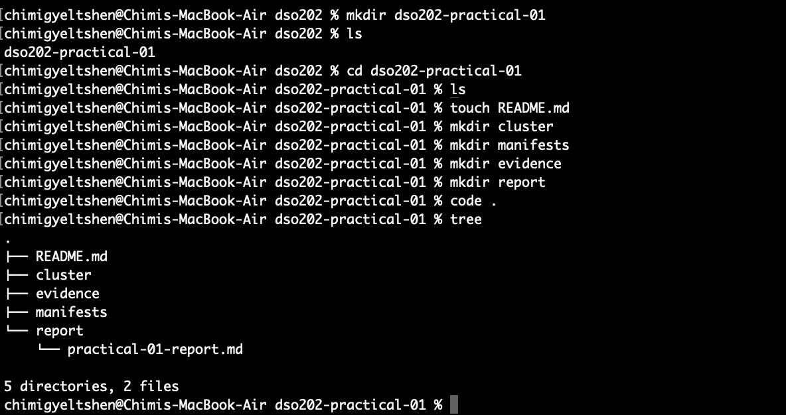

---

## 2. Prerequisites and Verification

Before provisioning the cluster, the following tools were installed and version-verified:

| Tool | Version | Purpose |
|---|---|---|
| **Docker Engine / Docker Desktop** | 24.0 | Provides the container runtime in which each Kind node runs |
| **Kind** | 0.32.0 | Creates and deletes local Kubernetes clusters |
| **kubectl** | 1.35 / 1.36 | Client used to communicate with the cluster |

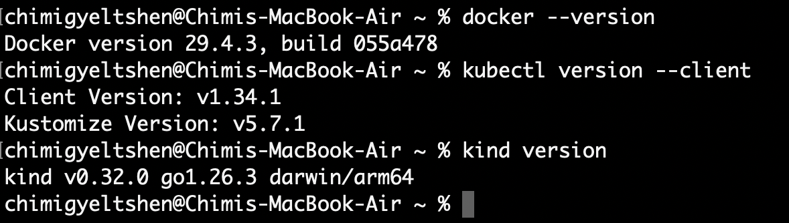

---

## 3. Cluster Architecture

Since no physical or cloud nodes were available for this practical, the local machine was used to host **three Docker containers**, each acting as a Kubernetes node:

- **1 Control Plane Node** — responsible for managing the cluster, and for scheduling and scaling decisions.
- **2 Worker Nodes** — run the actual application workloads and provide compute resources for the cluster.

---

## Stage 1 — Creating the Three-Node Cluster

### Step 1.1 — Define the Cluster Topology

A `kind-cluster.yaml` configuration file was created to describe the desired topology (one control-plane node, two worker nodes):

```bash
cd cluster
touch kind-cluster.yaml
```

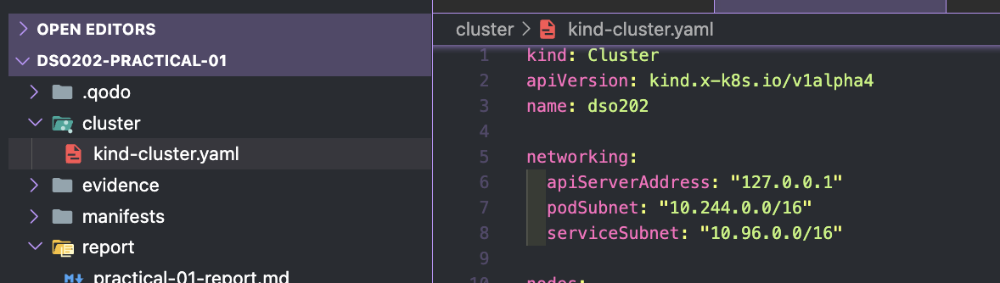

### Step 1.2 — Create the Cluster

The cluster was provisioned by passing the configuration file to `kind create cluster`:

```bash
kind create cluster --config cluster/kind-cluster.yaml
```

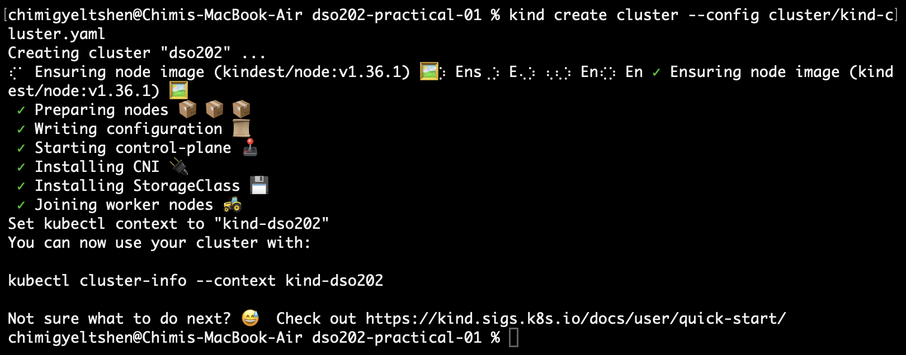

### Step 1.3 — Verify the Containers

Each Kind node runs as a Docker container. This was confirmed with:

```bash
docker ps
```

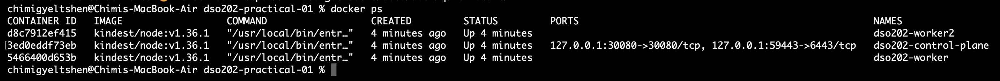

The three containers were then matched to their intended roles (control plane, worker-1, worker-2):

```bash
docker ps --format 'table {{.Names}}\t{{.Image}}\t{{.Status}}'
```

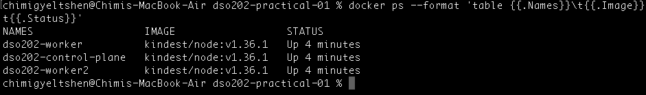

### Step 1.4 — Verify kubectl Context

Kind automatically creates and switches `kubectl` to a context named `kind-<cluster-name>`. This was confirmed with:

```bash
kubectl config current-context
```

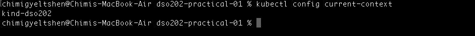

---

## Stage 2 — Inspecting the Cluster and Its Components

### Step 2.1 — Locate the Control Plane

```bash
kubectl cluster-info
```

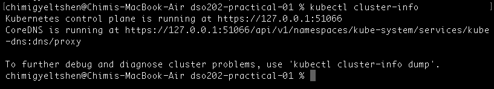

### Step 2.2 — List the Nodes

```bash
kubectl get nodes
```

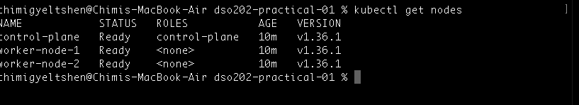

Additional detail was retrieved using the `-o wide` flag, which is the fastest way to get more information without switching to full YAML output:

```bash
kubectl get nodes -o wide
```

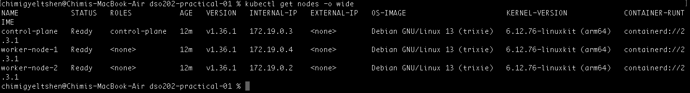

### Step 2.3 — Inspect a Single Node

```bash
kubectl describe node worker-node-1
```

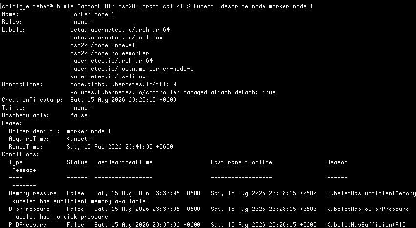

Node labels were extracted directly using `jsonpath`:

```bash
kubectl get node worker-node-1 -o jsonpath='{.metadata.labels}' | tr ',' '\n'
```

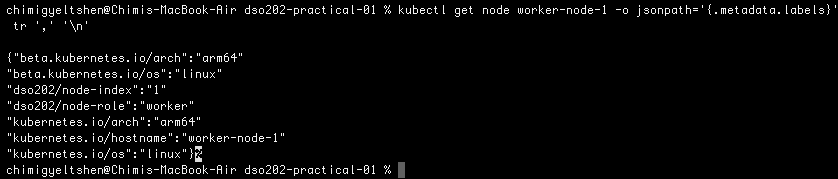

### Step 2.4 — List Namespaces

```bash
kubectl get namespaces
```

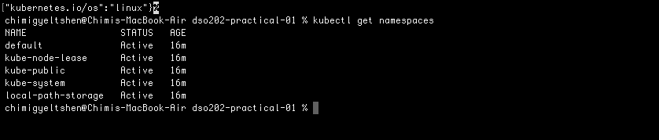

### Step 2.5 — Inspect Control Plane Components

```bash
kubectl get pods -n kube-system -o wide
```

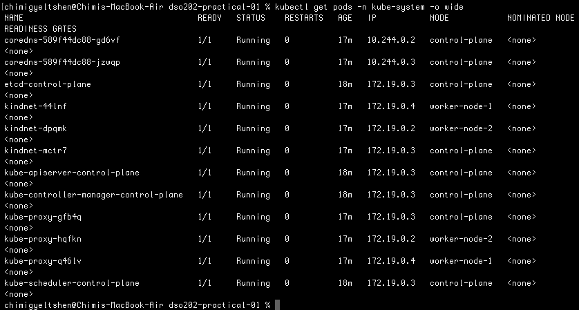

Logs for one control-plane component were read directly:

```bash
kubectl logs -n kube-system kube-scheduler-control-plane --tail=10
```

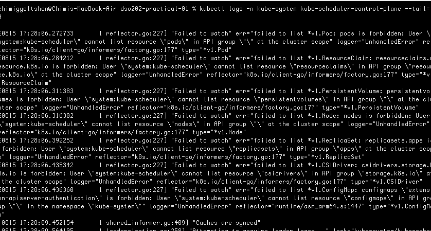

### Step 2.6 — Enumerate API Resources

The full list of object kinds the cluster understands was retrieved, split by whether the resource is namespaced:

```bash
kubectl api-resources --namespaced=true -o name | head -20
kubectl api-resources --namespaced=false -o name | head -10
```

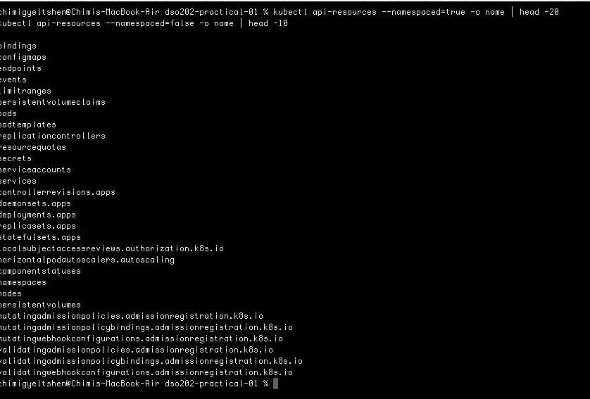

---

## Stage 3 — Namespaces, Resource Quotas, and Limit Ranges

### Step 3.1 — Create a Namespace Imperatively (for comparison only)

A namespace was first created imperatively purely to observe the imperative form, then deleted immediately — the declarative version below is the graded artefact.

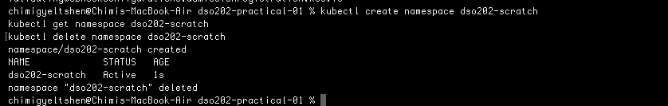

### Step 3.2 — Generate a Manifest Without Executing It

`kubectl create ... --dry-run=client -o yaml` was used to generate a manifest without applying it. Comparing this generated manifest against the hand-written declarative version showed that the declarative version adds labels which the generated version omits.

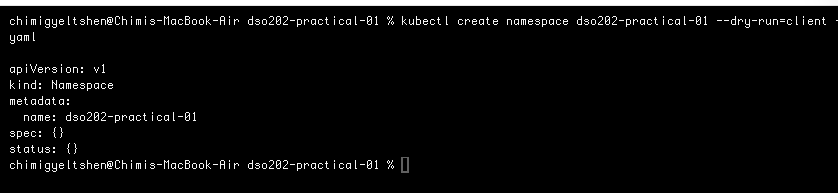

### Step 3.3 — Apply the Namespace Declaratively

The namespace definition was written to `manifests/00-namespace.yaml` and applied:

```bash
kubectl apply -f manifests/00-namespace.yaml
```

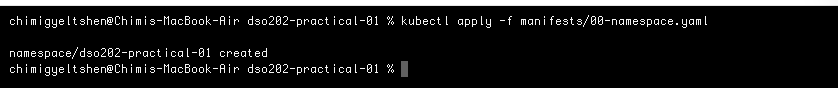

### Step 3.4 — Set the Default Namespace for the Context

To avoid typing `-n dso202-practical` on every subsequent command, the namespace was set as the default for the current context:

```bash
kubectl config set-context --current --namespace=dso202-practical
kubectl config view --minify --output 'jsonpath={..namespace}'
```

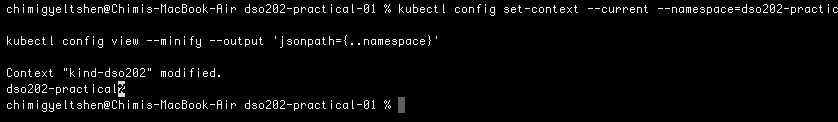

### Step 3.5 — Apply Resource Quota and Limit Range

`manifests/01-quota-and-limits.yaml` contains two objects (a `ResourceQuota` and a `LimitRange`) separated by `---`:

```bash
kubectl apply -f manifests/01-quota-and-limits.yaml
```

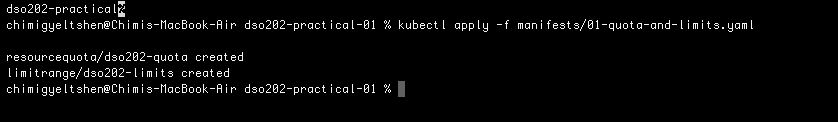

### Step 3.6 — Inspect the ResourceQuota

```bash
kubectl describe resourcequota dso202-quota
```

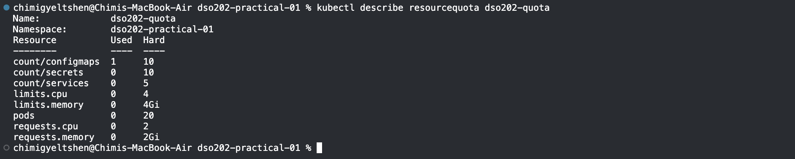

### Step 3.7 — Inspect the LimitRange

```bash
kubectl describe limitrange dso202-limits
```

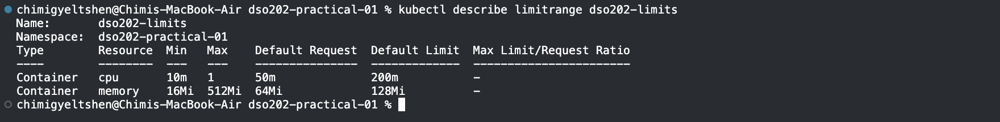

### Step 3.8 — Prove the LimitRange Is Enforced

A Pod was started imperatively with **no resource declaration** at all, and the resources actually stored by the cluster were read back:

```bash
kubectl run limitrange-check --image=nginx:1.30-alpine --restart=Never
kubectl get pod limitrange-check -o jsonpath='{.spec.containers[0].resources}'
echo
```

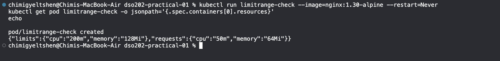

The check Pod was then removed, since it is not part of the graded deliverable:

```bash
kubectl delete pod limitrange-check
```

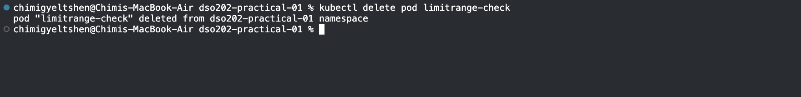

---

## Stage 4 — Pods

### Step 4.1 — Create a Pod Imperatively

```bash
kubectl run web-imperative \
  --image=nginx:1.30-alpine \
  --restart=Never \
  --port=80 \
  --labels='app=web,tier=frontend,managed-by=imperative'
```

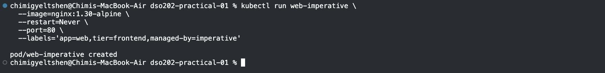

### Step 4.2 — Watch the Pod Reach Running

```bash
kubectl get pod web-imperative --watch
```

(`Ctrl+C` to stop watching.)

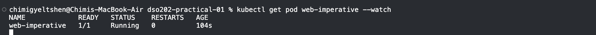

### Step 4.3 — Capture the Imperative Pod as a Manifest

This step bridges the imperative and declarative styles by exporting the live object definition:

```bash
kubectl get pod web-imperative -o yaml > evidence/web-imperative-as-stored.yaml
```

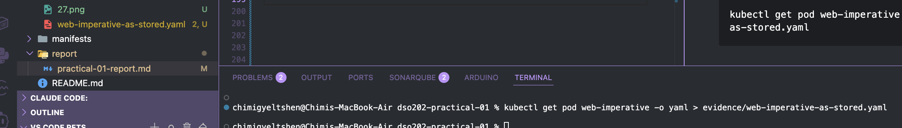

### Step 4.4 — Delete the Imperative Pod

```bash
kubectl delete pod web-imperative
```

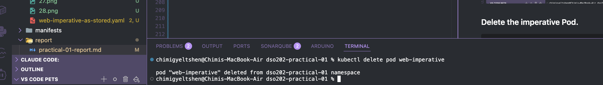

### Step 4.5 — Apply the Declarative Pod

`manifests/02-pod-web.yaml` was reviewed and applied:

```bash
kubectl apply -f manifests/02-pod-web.yaml
```

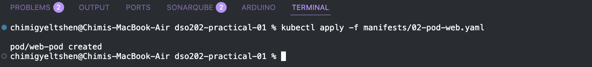

The same file was re-applied a second time, unchanged, to observe Kubernetes' idempotent behaviour (no diff, no restart):

```bash
kubectl apply -f manifests/02-pod-web.yaml
```

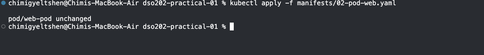

### Step 4.6 — Confirm Placement and Pod IP

```bash
kubectl get pod web-pod -o wide
```

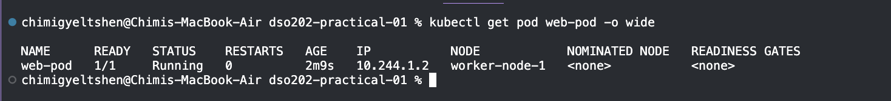

### Step 4.7 — Confirm Resource Declarations

```bash
kubectl get pod web-pod -o jsonpath='{.spec.containers[0].resources}'
echo
```

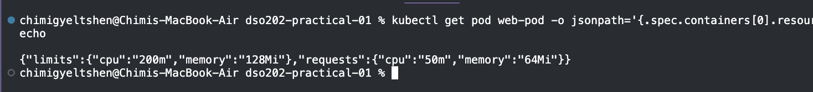

These values came from the manifest itself, not from the LimitRange defaults. This was confirmed by re-reading the quota:

```bash
kubectl describe resourcequota dso202-quota | grep -E 'requests.cpu|requests.memory|pods'
```

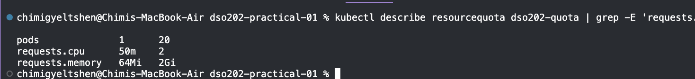

### Step 4.8 — Describe the Pod and Review Events

```bash
kubectl describe pod web-pod
```

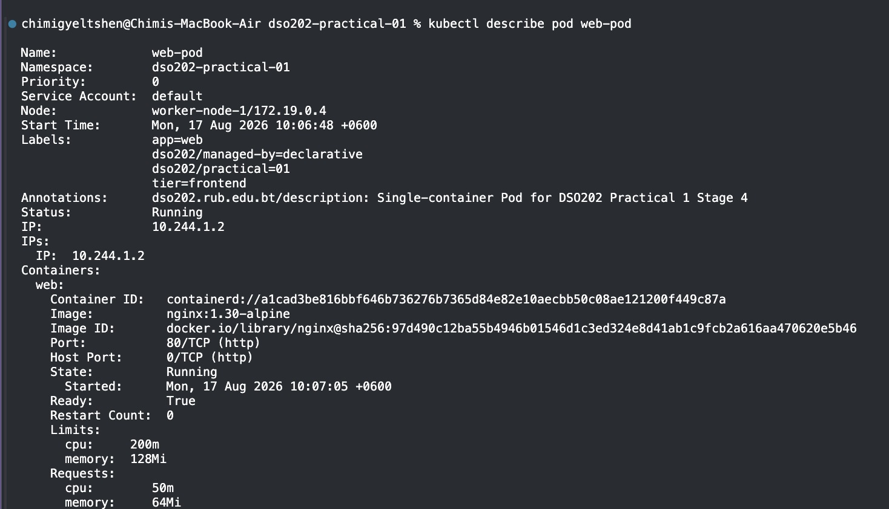

### Step 4.9 — Labels and Label Selectors

Labels were displayed alongside the Pod list:

```bash
kubectl get pods --show-labels
```

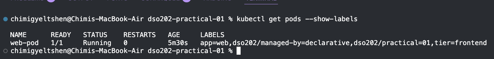

Pods were then selected by label — the same mechanism every controller and Service uses internally to find its Pods:

```bash
kubectl get pods -l app=web
kubectl get pods -l tier=frontend,managed-by=declarative
kubectl get pods -l 'tier in (frontend,backend)'
kubectl get pods -l app!=web
```

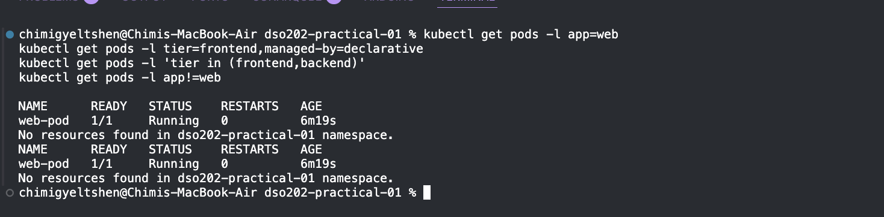

A label was added and then removed at runtime (a trailing hyphen removes a label):

```bash
kubectl label pod web-pod environment=practical
kubectl get pods -l environment=practical
kubectl label pod web-pod environment-
```

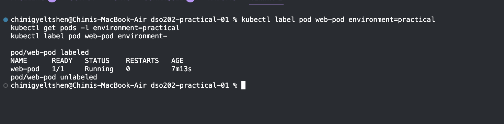

### Step 4.10 — Annotations

An annotation was added to demonstrate that, unlike labels, annotations cannot be used for selection:

```bash
kubectl annotate pod web-pod dso202.rub.edu.bt/practical="01"
kubectl get pod web-pod -o jsonpath='{.metadata.annotations}'
echo
```

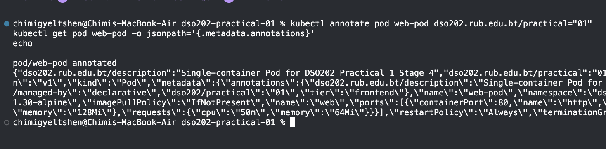

### Step 4.11 — Logs, Exec, and Port-Forwarding

Container logs were streamed (`-f` follows, `--tail` limits history):

```bash
kubectl logs web-pod --tail=5
```

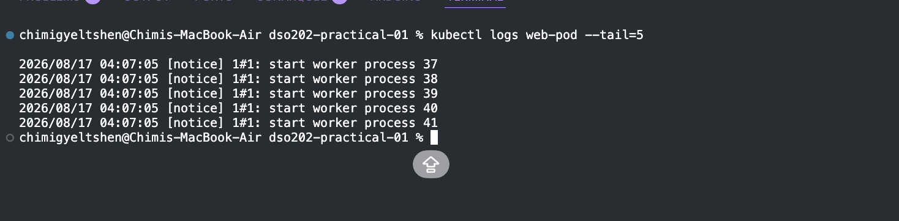

An interactive shell was opened inside the container. Because `nginx:1.30-alpine` is Alpine-based, the shell is `sh`, not `bash`:

```bash
kubectl exec -it web-pod -- sh
```

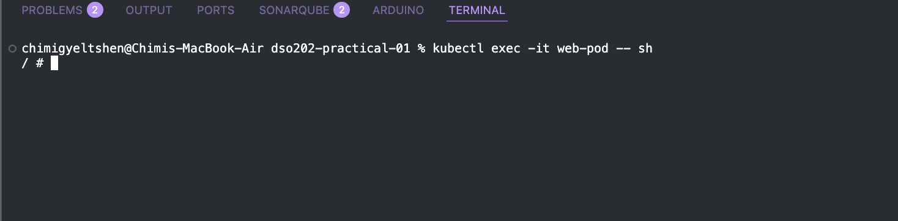
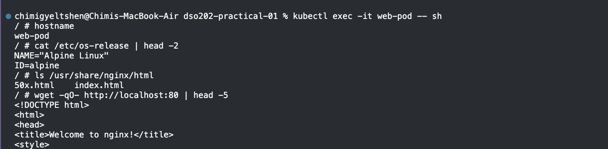

A single command was also run inside the container without an interactive session:

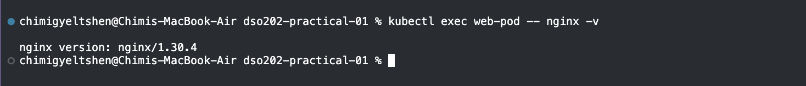

A local port was forwarded to the Pod — a tunnel from the host, through the API server, directly to the Pod. This is intended strictly for debugging, never for exposing an application:

```bash
kubectl port-forward pod/web-pod 8080:80
```


With that command left running, a second terminal confirmed connectivity:

```bash
curl http://localhost:8080
```


### Step 4.12 — Using `kubectl explain`

`kubectl explain` reads the schema directly from the live cluster, so its output is always correct for the running Kubernetes version:

```bash
kubectl explain pod.spec.containers.resources
kubectl explain pod.spec.containers.livenessProbe --recursive | head -30
```

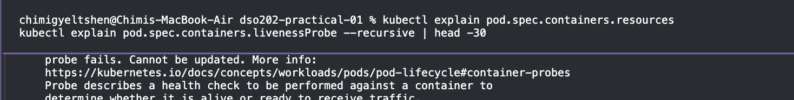

---

## Stage 5 — Deployments

### Step 5.1 — Generate a Deployment Manifest for Comparison

```bash
kubectl create deployment web-deployment \
  --image=nginx:1.30-alpine --replicas=3 --dry-run=client -o yaml | head -25
```

Comparing this generated output against the hand-written manifest showed everything the generated version omits: labels beyond the bare minimum, resource declarations, probes, a rollout strategy, and comments.

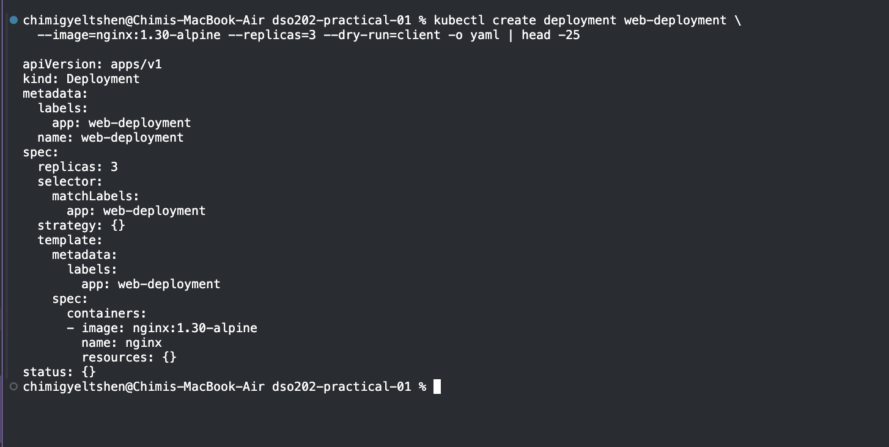

### Step 5.2 — Apply the Declarative Deployment

```bash
kubectl apply -f manifests/03-deployment-web.yaml
kubectl rollout status deployment/web-deployment
```

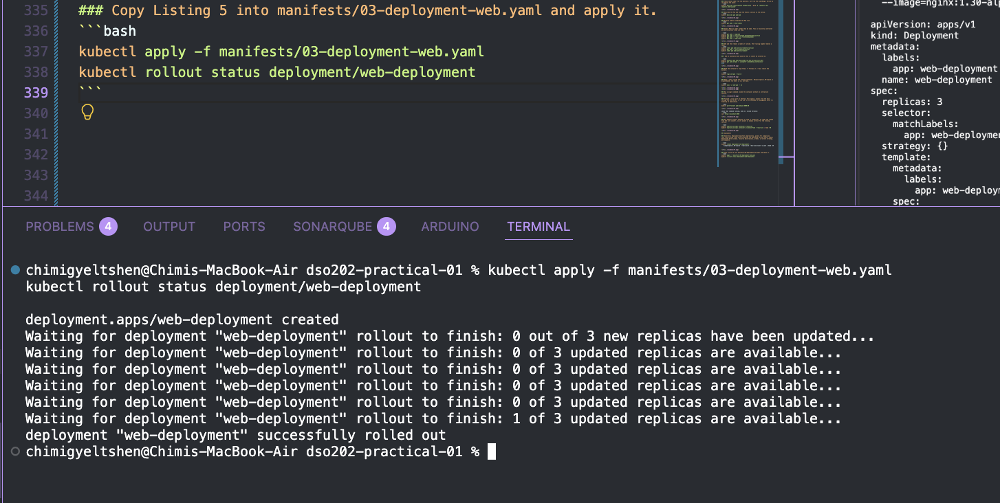

### Step 5.3 — Observe the Ownership Chain

Kubernetes Deployments manage ReplicaSets, which in turn manage Pods. This three-level ownership chain was observed directly:

```bash
kubectl get deployment,replicaset,pod -l app=web
```

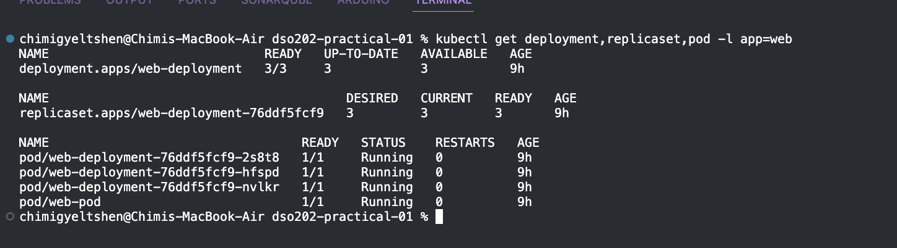

The ownership relationship was confirmed explicitly rather than inferred from naming conventions:

```bash
kubectl get replicaset -l app=web -o jsonpath='{.items[0].metadata.ownerReferences[0].kind}/{.items[0].metadata.ownerReferences[0].name}{"\n"}'
```

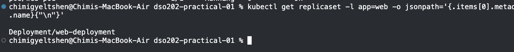

```bash
kubectl get pods -l app=web -o wide --no-headers | awk '{print $1, $7}'
```

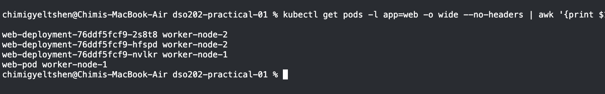

### Step 5.4 — Self-Healing Demonstration

A Pod was deleted and the Pod list was immediately re-queried:

```bash
victim=$(kubectl get pods -l app=web -o jsonpath='{.items[0].metadata.name}')
echo "deleting $victim"
kubectl delete pod "$victim"
kubectl get pods -l app=web
```

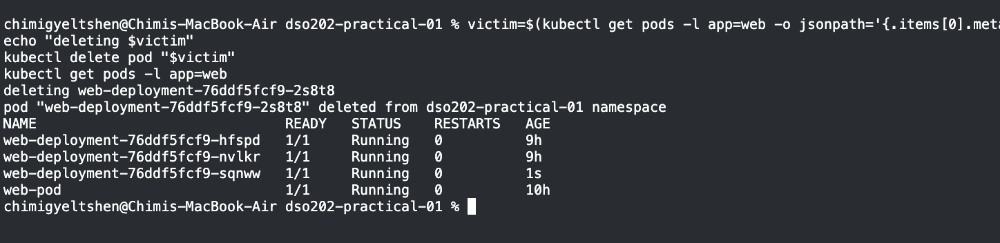

A replacement Pod appeared within seconds, carrying the same ReplicaSet name prefix but a new random suffix. This before-and-after listing is the clearest illustration of the reconciliation loop observed in this practical:

```bash
kubectl get events --field-selector reason=SuccessfulCreate --sort-by=.lastTimestamp | tail -3
```

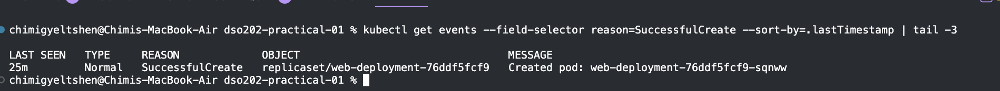

---

## Stage 6 — Scaling

### Step 6.1 — Scale Imperatively

```bash
kubectl scale deployment web-deployment --replicas=5
kubectl get deployment web-deployment
```

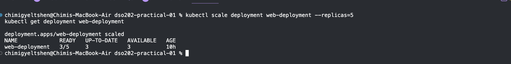

### Step 6.2 — Return to Declared State

Rather than scaling back down imperatively, the unmodified manifest was re-applied — restoring the Deployment to its declared state of three replicas and demonstrating that declarative configuration always wins as the source of truth:

```bash
kubectl apply -f manifests/06-deployment-web.yaml
kubectl get deployment web-deployment
```

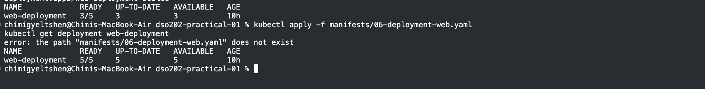

---

## Stage 7 — Rolling Updates and Rollbacks

### Step 7.1 — Watch the Rollout

In a second terminal:

```bash
kubectl get pods -l app=web --watch
```

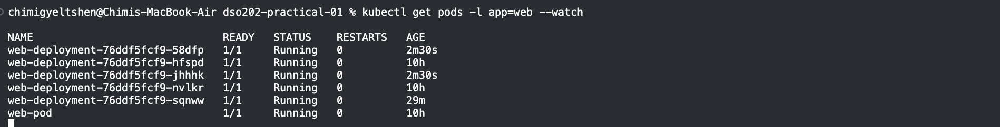

### Step 7.2 — Trigger an Image Update

In the first terminal, the image version was changed from `nginx:1.30-alpine` (the stable release used so far) to `nginx:1.31-alpine` (the current mainline release):

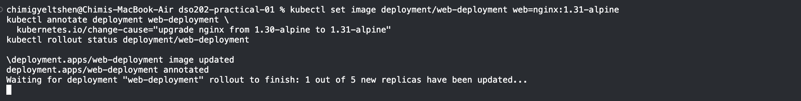

### Step 7.3 — Confirm Two ReplicaSets Exist

```bash
kubectl get replicaset -l app=web
```

One ReplicaSet was scaled to the new desired count, the other scaled down to zero — Kubernetes retains the old ReplicaSet to support rollback.

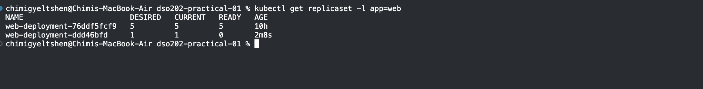

### Step 7.4 — Review Revision History

```bash
kubectl rollout history deployment/web-deployment
```

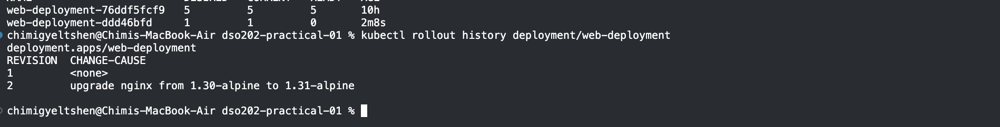

A single revision was inspected in detail:

```bash
kubectl rollout history deployment/web-deployment --revision=1 | grep -i image
```

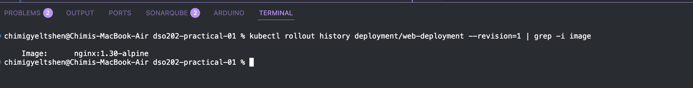

### Step 7.5 — Roll Back

```bash
kubectl rollout undo deployment/web-deployment
kubectl rollout status deployment/web-deployment
kubectl get deployment web-deployment -o jsonpath='{.spec.template.spec.containers[0].image}{"\n"}'
```

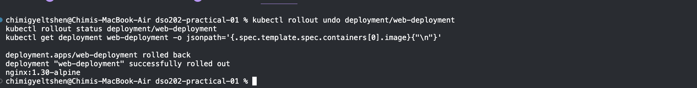

### Step 7.6 — Simulate and Recover From a Failed Rollout

A deliberately broken image tag was set, since a rollout that cannot succeed must be recognised quickly:

```bash
kubectl set image deployment/web-deployment web=nginx:9.99-does-not-exist
kubectl rollout status deployment/web-deployment --timeout=60s
```

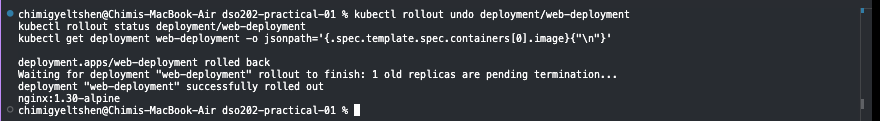

```bash
kubectl get pods -l app=web
```

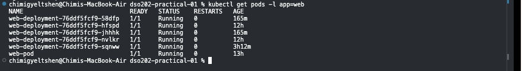

The failure was diagnosed and undone:

```bash
kubectl describe pod -l app=web | grep -A3 'Failed'
kubectl rollout undo deployment/web-deployment
kubectl rollout status deployment/web-deployment
kubectl get pods -l app=web
```

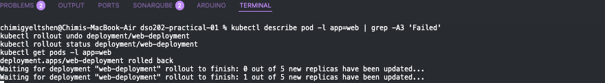

### Step 7.7 — Restore the Declared State

The repository manifest was re-applied so that the cluster state and the version-controlled manifest agree again:

```bash
kubectl apply -f manifests/03-deployment-web.yaml
kubectl diff -f manifests/03-deployment-web.yaml && echo "cluster matches manifest"
```

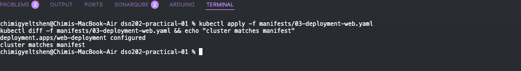

---

## Stage 8 — Services

### Step 8.1 — Apply a ClusterIP Service

```bash
kubectl apply -f manifests/04-service-clusterip.yaml
kubectl get service web-clusterip
```

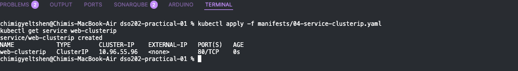

### Step 8.2 — Inspect the EndpointSlice

The EndpointSlice controller generated the actual list of Pod addresses the Service will route traffic to:

```bash
kubectl get endpointslice -l kubernetes.io/service-name=web-clusterip
```

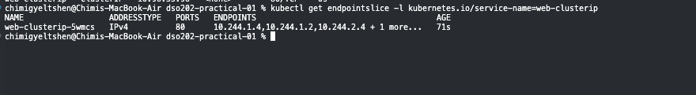

### Step 8.3 — Deploy a Client Pod

A dedicated client Pod was applied to issue requests from inside the cluster:

```bash
kubectl apply -f manifests/09-pod-client.yaml
kubectl wait --for=condition=Ready pod/client-pod --timeout=60s
```

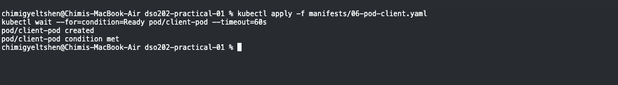

### Step 8.4 — DNS Resolution and Connectivity

The Service name was resolved from inside the cluster:

```bash
kubectl exec client-pod -- nslookup web-clusterip
```

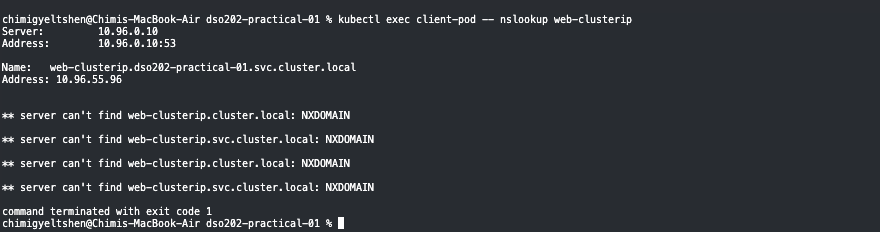

Requests were sent through the Service:

```bash
kubectl exec client-pod -- wget -qO- http://web-clusterip | head -4
```


### Step 8.5 — Load-Balancing Demonstration

Each backend Pod's hostname is its own Pod name, so writing a distinct page into each Pod makes load distribution visible:

```bash
for pod in $(kubectl get pods -l app=web -o name); do
  kubectl exec "${pod#pod/}" -- sh -c 'echo "served by $HOSTNAME" > /usr/share/nginx/html/index.html'
done

for i in $(seq 1 9); do
  kubectl exec client-pod -- wget -qO- http://web-clusterip
done | sort | uniq -c
```

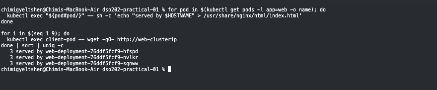

### Step 8.6 — Readiness Gates Traffic

The readiness probe defined in the Deployment checks `/index.html`. Deleting that file on one Pod causes the readiness probe to fail (its liveness probe is a TCP check, which keeps passing, so the container is not restarted):

```bash
target=$(kubectl get pods -l app=web -o jsonpath='{.items[0].metadata.name}')
kubectl exec "$target" -- rm -f /usr/share/nginx/html/index.html
sleep 15
kubectl get pod "$target"
kubectl get endpointslice -l kubernetes.io/service-name=web-clusterip
```

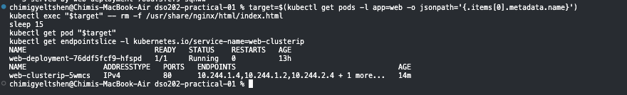

The Pod remained `Running` with zero restarts but was removed from the EndpointSlice and received no further traffic (confirmed by repeating the nine-request loop — only two Pod names appeared). It was then restored:

```bash
kubectl exec "$target" -- sh -c 'echo "served by $HOSTNAME" > /usr/share/nginx/html/index.html'
sleep 10
kubectl get endpointslice -l kubernetes.io/service-name=web-clusterip
```

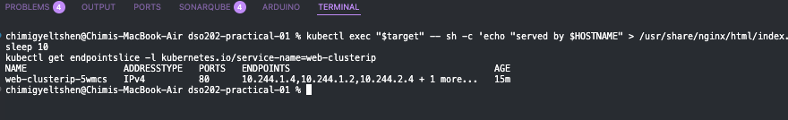

### Step 8.7 — Common Fault: Selector Mismatch

```bash
kubectl create service clusterip broken-service --tcp=80:80
kubectl get endpointslice -l kubernetes.io/service-name=broken-service
```

The imperative command generated the selector `app=broken-service`, which no Pod carries — leaving the EndpointSlice empty and every request to the Service refused. **An empty EndpointSlice is the diagnostic signature of a selector mismatch.**

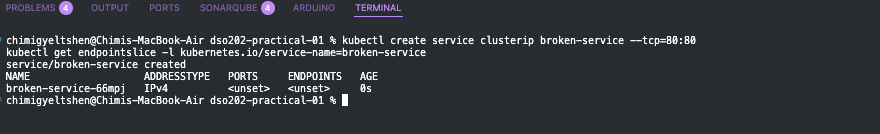

The broken Service was removed:

```bash
kubectl delete service broken-service
```

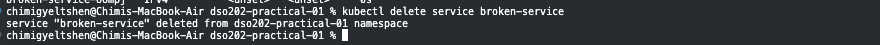

### Step 8.8 — NodePort Service

`manifests/05-service-nodeport.yaml` fixes `nodePort: 30080`, matching the port published from the control-plane container to the host in the Kind cluster configuration:

```bash
kubectl apply -f manifests/05-service-nodeport.yaml
kubectl get service
```

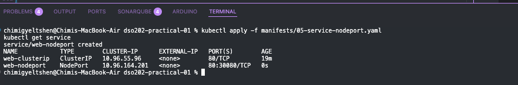

The application was reached from the host machine, outside the cluster, with no `port-forward` running:

```bash
curl -s http://localhost:30080
```

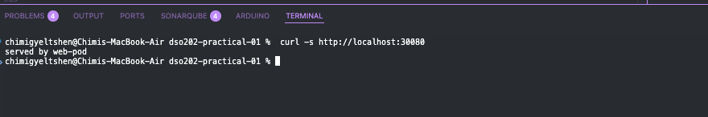

The node port was confirmed open on every node, not only the one published to the host:

```bash
docker exec dso202-worker curl -s http://localhost:30080
```

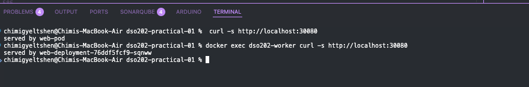

### Step 8.9 — LoadBalancer Limitation in Kind

A `LoadBalancer` Service was created to demonstrate that it cannot fully complete in a Kind cluster (no external load balancer integration exists locally), so the behaviour is recognised as expected rather than mistaken for a fault:

```bash
kubectl create service loadbalancer lb-demo --tcp=80:80
kubectl get service lb-demo
kubectl delete service lb-demo
```

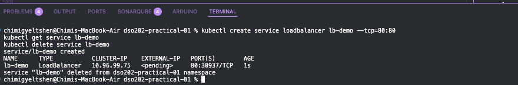

---

## Stage 9 — Cleanup

### Step 9.1 — Capture Final Evidence

Before deleting anything, the final cluster state was captured to disk:

```bash
mkdir -p evidence
kubectl get all -o wide > evidence/final-state-all.txt
kubectl get resourcequota,limitrange,endpointslice -o wide >> evidence/final-state-all.txt
kubectl get nodes -o wide > evidence/final-state-nodes.txt
kubectl get events --sort-by=.lastTimestamp > evidence/final-state-events.txt
```

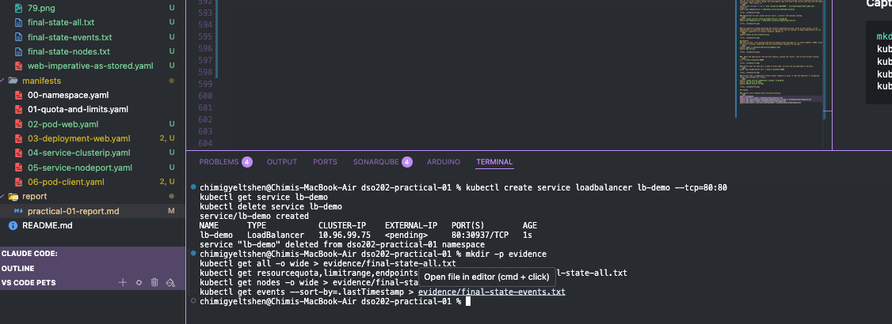

### Step 9.2 — Delete Workload Objects Declaratively

Objects were deleted in reverse order of creation, using the same manifest files that created them — this is the check that confirms no object was created outside version control:

```bash
kubectl delete -f manifests/06-pod-client.yaml
kubectl delete -f manifests/05-service-nodeport.yaml
kubectl delete -f manifests/04-service-clusterip.yaml
kubectl delete -f manifests/03-deployment-web.yaml
kubectl delete -f manifests/02-pod-web.yaml
```

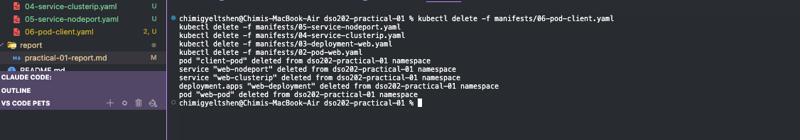

### Step 9.3 — Confirm Namespace Is Empty

```bash
kubectl get all
```

Only the ResourceQuota and LimitRange objects remained, as expected.

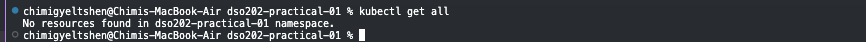

### Step 9.4 — Rebuild Everything to Prove Reproducibility

`kubectl apply -f` accepts a directory and applies its files in lexical order — exactly why the manifest filenames are numbered:

```bash
kubectl apply -f manifests/
kubectl get all
```

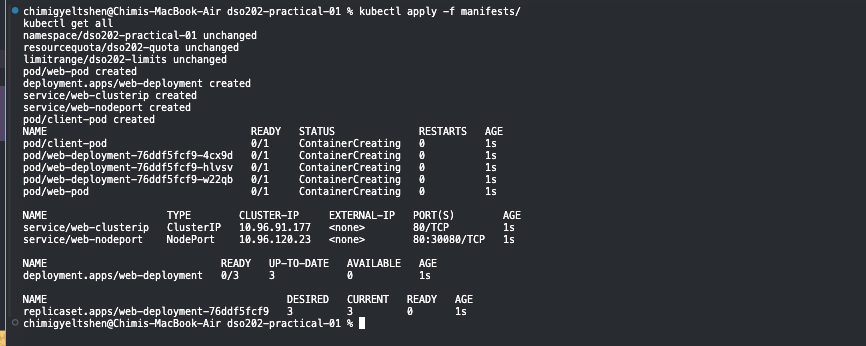

### Step 9.5 — Reset the Default Namespace

To avoid silently placing future work in this practical's namespace:

```bash
kubectl config set-context --current --namespace=default
```


### Step 9.6 — Delete the Cluster

```bash
kind delete cluster --name dso202
kind get clusters
docker ps
```

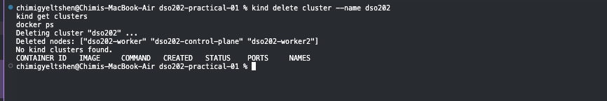

The Kind node image (roughly 1 GB) was optionally retained to speed up future cluster creation:

```bash
kind get clusters
```

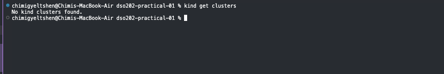

---

## 13. Key Learnings

- **Imperative vs. declarative workflows** — Imperative commands (`kubectl run`, `kubectl create`) are fast for exploration, but declarative manifests (`kubectl apply -f`) are the source of truth for reproducible, version-controlled infrastructure.
- **Ownership chains** — Deployments own ReplicaSets, which own Pods. Deleting a Pod under a Deployment triggers automatic reconciliation and self-healing within seconds.
- **Resource governance** — `ResourceQuota` caps aggregate namespace consumption, while `LimitRange` supplies default resource requests/limits to Pods that don't declare their own.
- **Labels vs. annotations** — Labels are selectable and drive Service/controller matching; annotations are metadata only and cannot be selected on.
- **Readiness vs. liveness probes** — Readiness failures remove a Pod from Service load balancing without restarting it; liveness failures restart the container. The two are independent signals.
- **Rolling updates** — Every update creates a new ReplicaSet; the previous one is retained (scaled to zero) to support instant rollback via revision history.
- **Service types in Kind** — `ClusterIP` and `NodePort` work natively in Kind; `LoadBalancer` cannot be provisioned without an external controller (e.g., MetalLB), since Kind has no cloud provider integration.
- **Diagnostics** — An empty `EndpointSlice` is the clearest signal of a Service selector mismatch.

## 14. Conclusion

This practical provided hands-on experience across the full lifecycle of a Kubernetes workload — from provisioning a multi-node cluster with Kind, through namespace and resource governance, to Pods, Deployments, rolling updates, rollbacks, and Services — using both imperative and declarative approaches. Working through failure scenarios (a broken rollout, a Service with a mismatched selector, and a Pod failing its readiness probe) reinforced how Kubernetes' reconciliation model detects and recovers from these conditions, which is central to its role as a self-healing container orchestration platform.
